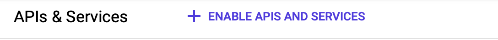

# Setup your own SAP System on Google Cloud

[Thomas Wecker](https://medium.com/@ThomasWecker?source=post_page-----23ec5aa196d6--------------------------------)         [Jun 30, 2019·5 min read](https://medium.com/@ThomasWecker/setup-your-own-sap-system-on-google-cloud-23ec5aa196d6?source=post_page-----23ec5aa196d6--------------------------------)

Original post: https://medium.com/@ThomasWecker/setup-your-own-sap-system-on-google-cloud-23ec5aa196d6

As a developer I’m constantly looking to get my hands on the latest SAP solutions. In the past this was rather difficult but in the recent months SAP as well as most of the bigger Cloud Providers like Google, AWS and Microsoft have expanded their cloud offerings, enabling SAP developers to get their hands on the latest SAP solutions in the cloud.

With this article I want to give you guideline how you could setup your own SAP system on Google Cloud Platform.

## Prerequisites:
-  You have an account on SAP Cloud Appliance Library ( [https://cal.sap.com](https://cal.sap.com)  )
-  You have an account on Google Cloud Platform

## Setup Google Cloud Platform

Use the Google Cloud Console to setup a new project.(https://console.cloud.google.com)

   
***Google Cloud Console***

Click on the arrow and select “New project”.

It will take about 30 sec. until the project is created.

## Create a service account

You will need to create a service account on GCP which later can be used to connect and deploy your SAP system from the SAP Cloud Appliance Library to GCP.

      
***Create a Service account***

 
Click on “Create Service Caccount” and give it a proper name.

The service account requires following roles to host your SAP instance:  
-  Compute Instance Admin (v1)
-  Compute Network Admin
-  Compute Security Admin

       
***Add required roles to your service account***

 
In the last step of the service account creation you need to generate the private key for the account and store it in JSON format. Click on  create key ** to download the private key to your local computer. You will get a JSON file (a private key for the account) that you will need later to establish the connection between CAL and GCP.

       
***Keep the default JSON as recommended***

 
Click done and your service account is ready.
 

## Enable necessary API’s on GCP

There are a couple of API’s necessary to connect SAP CAL with GCP.

Navigate to the API’s & Services Dashboard

Select “Enable APIs and Services”

In the search field, search for   Google Cloud Resource Manager * **

Select and enable the API by pressing the enable button.

If you miss this one, you will get an error message when you try to upload the JSON file in SAP CAL.

In addition you also need to enable the   Compute Engine API.  * **Enabling the Compute Engine API requires you to enable billing for the account (if you don’t have done this yet) and link it to your project.

## Setup firewall rules

To be able to access the system using Eclipse ADT as well as to call Odata services on SAP Gateway you will need to setup and adjust the firewall rules. For my environment I had to set them up as follows:

tcp:22, tcp:3200, tcp:8443, tcp:3300, tcp:5000, tcp:8000

Note: Especially port 3300 is important if you want to connect to the system using Eclipse ADT.

In the menu navigate to the networking section and select VPC Network → Firewall rules

 
With that we are done on GCP side!
 

## Setup SAP Cloud Appliance Library (CAL)

On the CAL console search for the SAP system that you would like to deploy. The deployment process is pretty much the same independant from the SAP system you wish to install.

       
***SAP Cloud Appliance Library Console***

Click on “Create Instance” and accept the license agreement. On the next page give your instance a name and select  Google Cloud Platform ** as the cloud provider and upload the JSON file containing your private key.

After the upload, zones and regions need to be configured. Next, set a password to access the instance. This password will also be used to log into the system using SAP GUI.

The initial installation of the system takes around 60–90 minutes depending on the system.

Once the instance got created it gets automatically activated.

## Connect to your new SAP instance

Click “Connect” to connect to your new SAP system.

For the pre-defined users and password, refer to the “Getting started Guide”. You’ll find the link on top of the pop-up window.

## Update minisap license key

Usually the SAP CAL systems are demo systems with a limited run time, in most cases this is around 30 days. However there are also SAP developer systems which can be used for development purposes > 30 days.

       
***SAP License Keys for Developer Versions***

To update your SAP license key in such a system proceed as follows:  
-  Logon to AS ABAP via SAP GUI with user SAP* in client 000.
-  Start transaction SLICENSE
-  Generate a “Minisap” license at  [http://www.sap.com/minisap](http://www.sap.com/minisap)
-  Choose your system (in my case I chose NPL)

        
-  As hardware key use the hardware key shown in transaction SLICENSE
-  Click on “Generate” after you are done. The license key will be downloaded automatically to your local PC.
-  Navigate back to transaction SLICENSE in your SAP ABAP instance.
-  On the Digitally -Signed Licenses tab, choose delete License.
-  Choose install new license and select the license downloaded in the previous step. This is needed to enable RFC after the changing the installation number from INITIAL to DEMOSYSTEM.

Note that the Minisap license has an expiration period and after it, you can renew it with the same procedure over and over again.

